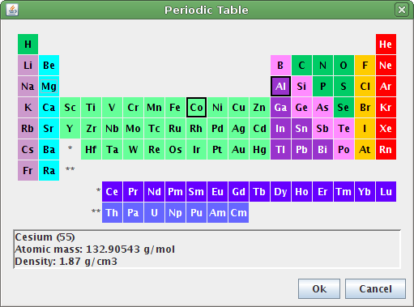
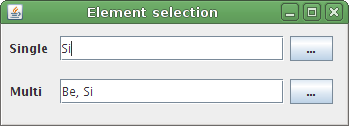
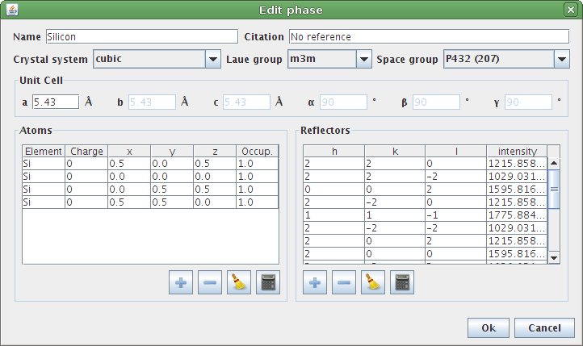

*jchemistry* is a Java library for chemistry and crystallography information.

Features
========

Core
----

* Enum containing all elements from periodic table
* Physical, atomic and miscellaneous properties of the elements: atomic radius,
  boiling temperature, density, thermal conductivity, etc.
* Enum of all 230 space groups
* Class for atom positions, unit cell and reflectors
* Crystallography calculations: plane spacing, diffraction angle, bond angle, 
  bond distance, etc.
* Scattering factors for electrons and x-rays
* Reader and writer of Crystallographic Information File 
  (`cif <http://www.iucr.org/resources/cif>`_)

See the `examples <examples.html>`_ section or the `javadoc <javadoc/>`_ 
for more information.

GUI (swing)
-----------

* Dialog with a full periodic table

..

* Field to select element

..

* Dialog to create, edit and view crystallographic phase information

..
